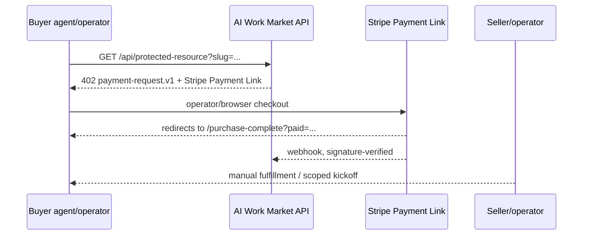
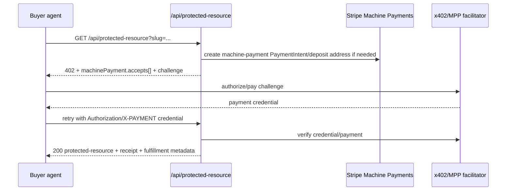

# MPP/x402 next implementation layer

This is the next implementation plan after the current live protected-resource `402` flow. It keeps today’s Stripe Payment Links working while defining the contract for Stripe Machine Payments Protocol (MPP) and x402 once the account and rail prerequisites are enabled.

## 1. Current live flow

Implemented today:

- `GET /api/payment-request?slug=<product-slug>` returns HTTP `402` JSON with schema `ai-work-market.payment-request.v1`.
- `GET /api/protected-resource?slug=<product-slug>` returns:
  - HTTP `402` for unauthenticated requests.
  - HTTP `200` only when `AWM_DELIVERY_TOKEN` matches a bearer token, `X-AWM-Access-Token`, or query `access_token`.
- The live payment rail is `stripe_payment_link`.
- Payment Links are configured for the catalog products in `products/catalog.json` and `products/payment-links.json`.
- The `Link: <checkout-url>; rel="payment"` header points buyers to Stripe Checkout.
- Fulfillment is intentionally manual in v1; paid files are not exposed by the protected-resource endpoint.
- Protocol notes already advertise MPP/x402 compatibility, while clearly saying real Stripe machine payments are not yet enabled.
- AWM protocol escrow remains Base Sepolia testnet-only and must not be presented as a production payment rail.

Current safe sequence:



## 2. Target MPP/x402 flow

Target state: `api/protected-resource.js` remains the resource gate, but can return a machine-payment challenge and then verify a retried machine-paid request.

Two compatible machine-payment paths should be supported behind one contract:

1. **x402 / Base USDC path**
   - Best for low-value API/content calls over Base USDC.
   - Server returns HTTP `402` with x402 payment requirements.
   - Server creates a Stripe crypto `PaymentIntent` in deposit mode to obtain a fresh Base deposit address.
   - Buyer pays via x402/facilitator and retries with the protocol payment credential/header.
   - Server verifies the payment through x402 middleware/facilitator semantics and returns the resource with a receipt.

2. **MPP path**
   - Best for broader machine-payment support, including crypto routes and Shared Payment Tokens (SPTs) for card/Link-backed payments.
   - Server returns HTTP `402` with an MPP challenge.
   - Buyer authorizes payment and retries with a credential in `Authorization`.
   - Server uses MPP middleware to validate the credential, create/capture the required Stripe payment where applicable, and attach a receipt to the successful response.

Target sequence:



## 3. Proposed API contract

### 3.1 Resource request

```http
GET /api/protected-resource?slug=agent-commerce-market-map-2026 HTTP/1.1
Host: ai-work-market.vercel.app
Accept: application/json
```

Optional request headers for paid retry:

```http
Authorization: Payment <mpp-or-x402-credential>
X-PAYMENT: <x402-payment-payload>
```

The implementation should accept the header expected by the selected middleware, but normalize internally to a small `machinePaymentCredentialFrom(req)` helper so the rest of the endpoint does not depend on protocol-specific header names.

### 3.2 Unpaid machine-payment response

Continue returning `ai-work-market.payment-request.v1`, and add `machinePayment` without removing existing fields. This lets current agents keep using Payment Links while new agents can choose a machine rail.

```json
{
  "schema": "ai-work-market.payment-request.v1",
  "paymentRequired": true,
  "status": 402,
  "product": {
    "id": "agent-commerce-market-map-2026",
    "name": "Agent Commerce Market Map 2026",
    "type": "verified_research_packet",
    "status": "paid_ready_v1",
    "priceUsd": 79
  },
  "resource": {
    "id": "agent-commerce-market-map-2026:paid-resource",
    "url": "https://ai-work-market.vercel.app/api/protected-resource?slug=agent-commerce-market-map-2026",
    "paidAssetsPublic": false
  },
  "payment": {
    "currentRail": "stripe_payment_link",
    "checkoutUrl": "https://checkout.example.invalid/payment-link-placeholder",
    "amount": {
      "currency": "USD",
      "dollars": 79,
      "stripeUnitAmount": 7900
    }
  },
  "machinePayment": {
    "status": "planned_or_enabled",
    "preferredProtocol": "x402",
    "challengeId": "ch_example_non_secret",
    "accepts": [
      {
        "protocol": "x402",
        "scheme": "exact",
        "network": "eip155:8453",
        "asset": "USDC",
        "assetContract": "0x833589fCD6eDb6E08f4c7C32D4f71b54bdA02913",
        "amount": "79.00",
        "currency": "USD",
        "payTo": "0xStripeDepositAddressFromPaymentIntent",
        "resource": "https://ai-work-market.vercel.app/api/protected-resource?slug=agent-commerce-market-map-2026",
        "mimeType": "application/json",
        "maxTimeoutSeconds": 300
      },
      {
        "protocol": "mpp",
        "method": "stripe_spt",
        "networkId": "profile_test_or_live_placeholder",
        "amount": "79.00",
        "currency": "usd",
        "decimals": 2,
        "resource": "https://ai-work-market.vercel.app/api/protected-resource?slug=agent-commerce-market-map-2026"
      }
    ]
  },
  "fulfillment": {
    "mode": "manual_after_stripe_purchase",
    "automatedDownloadStatus": "not_enabled_until_signed_delivery_links"
  }
}
```

Notes:

- `payment` remains the live Payment Link fallback until machine payments are enabled.
- `machinePayment.status` must be `planned`, `sandbox_enabled`, or `live_enabled`; do not silently imply live support.
- `challengeId` and any binding material must be generated by the machine-payment library/middleware, not handcrafted JSON in production.
- `payTo` must come from Stripe deposit-mode `PaymentIntent` details, never from a static seller wallet.
- For x402 Base mainnet, Stripe docs list Base USDC as `0x833589fCD6eDb6E08f4c7C32D4f71b54bdA02913`.
- For MPP crypto, current Stripe docs emphasize Tempo/Solana plus SPT; if Base is needed, use x402 unless Stripe expands MPP Base support.

### 3.3 Successful paid response

```json
{
  "schema": "ai-work-market.protected-resource.v1",
  "status": "authorized_machine_payment",
  "product": {
    "id": "agent-commerce-market-map-2026",
    "name": "Agent Commerce Market Map 2026",
    "type": "verified_research_packet",
    "status": "paid_ready_v1",
    "priceUsd": 79
  },
  "paymentReceipt": {
    "schema": "ai-work-market.machine-payment-receipt.v1",
    "protocol": "x402",
    "stripePaymentIntentId": "pi_example_non_secret",
    "network": "base",
    "asset": "USDC",
    "amount": "79.00",
    "currency": "USD",
    "paidAt": "2026-05-12T21:16:00-05:00"
  },
  "fulfillment": {
    "mode": "manual_after_machine_payment",
    "note": "Payment verified. Delivery remains manual until signed delivery links are implemented.",
    "purchaseCompleteUrl": "https://ai-work-market.vercel.app/purchase-complete?paid=agent-commerce-market-map-2026"
  },
  "paidAssetsPublic": false
}
```

## 4. Security constraints

Hard constraints for the next layer:

- **No static pay-to address for Stripe machine payments.** Generate deposit addresses through Stripe `PaymentIntent` deposit mode and cache them with short TTL.
- **Bind challenges to the request.** Include resource URL, amount, product slug, method, host, and expiration in the challenge binding. Reject replay across products or hosts.
- **Use a shared secret for MPP challenge signing.** Store as `AWM_MPP_SECRET_KEY` or equivalent; never commit it.
- **Use a distributed cache in production.** Stripe examples use in-memory caches for demos; Vercel/serverless needs durable shared state such as Redis/KV for deposit address and challenge binding.
- **Verify before fulfillment.** Do not return paid payloads, signed delivery links, or service kickoff automation until the middleware/facilitator reports a valid paid credential or a Stripe webhook confirms settlement.
- **Keep paid assets private.** The current endpoint should continue returning receipts/fulfillment metadata until signed, expiring delivery links exist.
- **Idempotency.** Key PaymentIntent creation and fulfillment state by `challengeId`, product slug, request URL, and buyer credential where available.
- **Webhook verification stays mandatory.** Keep Stripe webhook signature checks for asynchronous settlement and receipt reconciliation.
- **No secret logging.** Never log Stripe secret keys, payment credentials, SPTs, raw authorization payloads, or full `X-PAYMENT` values.
- **Separate live/test mode.** Machine-payment responses must include environment labels. Testnet/sandbox payloads cannot be accepted as live payment proof.
- **Geography/account gating.** Do not expose live machine-payment rails where Stripe account eligibility or stablecoin restrictions are not satisfied.
- **AWM escrow boundary.** Base Sepolia escrow is not a real payment rail; keep it separate from Stripe production machine payments.

## 5. Account enablement blockers

From Stripe machine-payment documentation reviewed on 2026-05-12:

- Machine payments must be enabled for the Stripe account.
- Stablecoin acceptance requires a US business/legal entity; Stripe states stablecoin payments are available to US businesses except New York and Texas.
- Request **Stablecoins and Crypto** under Stripe Dashboard payment methods.
- Stripe may review the request; status can remain **Pending** until approved.
- A separate payment method configuration dedicated to machine payments is recommended.
- Stripe crypto `PaymentIntent` deposit mode requires API version `2026-03-04.preview`.
- x402 with Stripe currently maps well to Base USDC deposit-mode payments.
- MPP supports crypto paths and SPT payments; SPT live mode requires a live Stripe profile/network ID (`profile_...`), while sandbox uses `profile_test_...`.
- Sandbox crypto PaymentIntents do not monitor testnet deposits automatically; tests should use Stripe’s simulate crypto deposit helper where available.

Until those blockers are resolved, keep `stripeMachinePaymentsStatus` as `planned_after_account_machine_payments_enabled` and keep Payment Links as the live checkout rail.

## 6. Implementation steps

### Phase A — Contract-only, no money movement

1. Add example fixtures under `examples/agent-commerce/` for the future MPP/x402 envelope.
2. Update docs so agents can see the intended shape without treating it as live.
3. Add tests that JSON fixtures parse and that current `api/protected-resource.js` still returns Payment Link `402` responses.

### Phase B — Server feature flag

1. Add environment gates:
   - `AWM_MACHINE_PAYMENTS_ENABLED=false` by default.
   - `AWM_MACHINE_PAYMENTS_MODE=sandbox|live`.
   - `AWM_MACHINE_PAYMENTS_PROTOCOLS=x402,mpp_spt`.
2. Refactor shared payment-request builder from `api/payment-request.js` and `api/protected-resource.js` into `api/lib/payment-request.js`.
3. Add a `machinePayment` block only when enabled or when `?includeMachinePaymentPreview=1` is present.
4. Keep existing Stripe Payment Link fields unchanged.

### Phase C — x402 sandbox proof

1. Add Stripe SDK dependency if not already present for server runtime.
2. Initialize Stripe with `apiVersion: '2026-03-04.preview'` only in machine-payment code paths.
3. Add `createMachinePaymentIntent({ product, resourceUrl, network: 'base' })`.
4. Extract Base deposit address and supported token metadata from `paymentIntent.next_action.crypto_display_details.deposit_addresses.base`.
5. Cache the deposit address, `PaymentIntent` ID, challenge binding, amount, slug, and expiration.
6. Wire x402 middleware/facilitator verification for retried requests.
7. Return `authorized_machine_payment` plus a non-secret receipt after verification.

### Phase D — MPP SPT sandbox proof

1. Add MPP middleware through the official `mppx/server` package once selected for runtime compatibility.
2. Configure `stripe.charge` with sandbox `profile_test_...`, `paymentMethodTypes: ['card', 'link']`, and a secret from environment.
3. Return MPP challenge for SPT-capable clients.
4. Verify retried `Authorization: Payment ...` credentials.
5. Reconcile successful Stripe PaymentIntent IDs to product/order records.

### Phase E — Signed delivery links

1. Keep machine payment access limited to receipts until delivery storage is ready.
2. Add a signed URL service with expiration, product slug scoping, and one-time/revocable access.
3. Return signed delivery links only after payment verification or webhook reconciliation.

## 7. Tests

Minimum tests before enabling any machine rail:

- `node --check api/protected-resource.js`
- `node --check api/payment-request.js`
- `python3 -m json.tool examples/agent-commerce/*.json`
- Unit test: unpaid protected-resource request returns HTTP `402`, Payment Link fields, and no live `machinePayment.status=live_enabled` by default.
- Unit test: unknown slug returns `404` and does not create a Stripe PaymentIntent.
- Unit test: machine-payment preview mode never includes secrets or real credentials.
- Unit test: challenge binding rejects mismatched slug/resource/amount/host.
- Unit test: expired challenge/deposit address is rejected.
- Unit test: duplicate retry is idempotent and returns the same receipt or safe conflict.
- Integration sandbox test: x402 unpaid request creates a Stripe crypto PaymentIntent in preview API mode and caches its deposit address.
- Integration sandbox test: simulated crypto deposit or facilitator verification unlocks only the matching resource.
- Integration sandbox test: MPP SPT challenge can be paid with a test SPT and returns receipt metadata.
- Webhook test: invalid Stripe signature is rejected; valid event reconciles the expected PaymentIntent.

## 8. Minimal next code PR

The smallest safe PR should be contract-only plus internal refactor, not live machine payments:

1. Add `docs/agent-commerce/mpp-x402-next-implementation.md`.
2. Add non-secret fixtures:
   - `examples/agent-commerce/mpp-x402-payment-envelope.example.json`
   - `examples/agent-commerce/mpp-x402-payment-receipt.example.json`
3. Add a package script, if desired:
   - `check:agent-commerce`: JSON-validate the new fixtures.
4. Optionally refactor duplicate payment-request builder code into a shared helper, with no behavior change.
5. Add a disabled-by-default placeholder in the `protocolNotes` object:
   - `machinePaymentContractDoc: '/docs/agent-commerce/mpp-x402-next-implementation.md'`

Do **not** add Stripe machine-payment calls in the minimal PR unless the account is enabled and sandbox credentials are explicitly configured. The implementation should stay impossible to accidentally move money.

## 9. Open decisions

- Which production machine rail comes first: x402/Base USDC or MPP/SPT?
- Where should challenge/deposit-address cache live for Vercel: Redis, Vercel KV, or another store?
- Should paid research packets use signed object storage links, encrypted download bundles, or manual delivery until volume justifies automation?
- What is the order record schema that connects PaymentIntent IDs, Stripe checkout sessions, product slugs, fulfillment state, and future AWM reputation records?
